# Office Asset Sources

This directory is the durable source catalog for the Aethel USD office
pipeline. It records every original free 3D asset that feeds into the
pipeline — before any conversion, format change, or scale normalisation
takes place.

**It is not a binary asset store.** Do not commit downloaded archives, raw
GLB packs, or any file large enough to require Git LFS. The catalog holds
only metadata: manifests, license snapshots, and provenance notes.

## Files

| File | Purpose |
|---|---|
| `manifest.json` | Machine-readable source catalog. One entry per asset; traces every USD prim and web GLB export back to its origin. |
| `manifest.schema.json` | JSON Schema for `manifest.json`. Validated by the vitest test suite. |
| `licenses/` | Optional snapshot directory. Place a plain-text copy of each licence here if the publisher licence page is at risk of being removed or changed. Files should be named `<licenseId>.txt` (e.g. `cc0-1.0.txt`). |

## Relationship to other docs and code

```mermaid
flowchart LR
    docs["docs/office-asset-sources.md\n(human provenance doc)"]
    manifest["assets/sources/office/manifest.json\n(machine catalog)"]
    usd["assets/usd/office/\n(canonical USD stage)"]
    exports["assets/exports/web/office/\n(pipeline-generated GLBs)"]
    webpublic["web/public/assets/office/\n(web runtime GLBs)"]
    runtimets["web/src/assets/officeAssetManifest.ts\n(web runtime manifest)"]

    docs -- "derived from (keep in sync)" --> manifest
    manifest -- "feeds" --> usd
    usd -- "make assets-export-web" --> exports
    exports -- "copied to" --> webpublic
    webpublic -- "served to browser" --> runtimets
```

- `docs/office-asset-sources.md` is the human-readable provenance document.
  When a new asset is added to that document, add a matching entry here.
- `manifest.json` is the machine-readable counterpart. Both files record the
  same source IDs. A vitest test (`web/src/assets/officeSourceManifest.test.ts`)
  asserts they do not drift.
- `assets/usd/office/` holds the canonical OpenUSD stage built from these
  sources.
- `assets/exports/web/office/` holds the GLB files exported from the USD
  stage by `make assets-export-web`.

## Adding a new asset

1. Confirm the licence is CC0 or public domain.
2. Add a row to `docs/office-asset-sources.md`.
3. Add a matching entry to `manifest.json` following the existing schema.
4. Run `make test` (or `cd web && bun run test`) to verify the drift-detection
   test still passes.
5. Do **not** commit the raw downloaded archive.

## Licence

All assets catalogued here are CC0 1.0 Universal unless otherwise noted in the
`manifest.json` `licenseId` field. See
<https://creativecommons.org/publicdomain/zero/1.0/> for the licence text.
