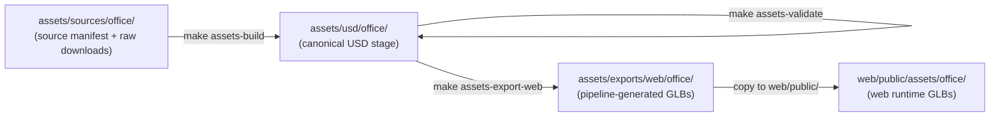

# Asset Pipeline

This document explains how to build, validate, and export the Aethel office
scene assets using the Make targets defined in the repo root `Makefile`.

## Overview

Aethel uses two representations of every scene asset:

- **Canonical USD** — OpenUSD files under `assets/usd/office/`. These are the
  authoritative source of truth for geometry, materials, hierarchy, and
  provenance metadata. They feed physics simulations, AI agent perception, and
  higher-fidelity rendering pipelines.

- **Web GLB** — Optimized GLB files under `assets/exports/web/office/`. These
  are derived exports from the USD stage, suitable for streaming to a browser
  via the Three.js / React Three Fiber renderer. The browser never loads USD
  directly.



## Make Targets

### `make assets-build`

Converts raw source assets (GLB/glTF/FBX files placed under
`assets/sources/office/`) into canonical OpenUSD files under
`assets/usd/office/`.

**Script:** `scripts/assets/assets-build.sh`

**Required tools:** Blender (see [Installing Blender](#installing-blender))

**Behavior when tools or source files are missing:**

- If no source files are present the script exits successfully with an
  informational message — no tool check failure occurs.
- If source files are present but Blender is not installed the script prints
  an install hint and exits non-zero.

```bash
make assets-build           # convert all source files
```

### `make assets-validate`

Validates all USD files in `assets/usd/office/` for parse and schema
correctness.

**Script:** `scripts/assets/assets-validate.sh`

**Required tools:** `usd-core` Python package (see
[Installing usd-core](#installing-usd-core))

**Behavior when tools or USD files are missing:**

- If no USD files exist yet the script exits successfully — the build step
  has not run yet and there is nothing to validate.
- If USD files exist but no validation tool is installed the script prints
  install instructions and exits non-zero.

```bash
make assets-validate        # validate all USD files
```

### `make assets-export-web`

Exports the canonical USD files to web-ready GLB files under
`assets/exports/web/office/`.

**Script:** `scripts/assets/assets-export-web.sh`

**Required tools:** Blender (see [Installing Blender](#installing-blender))

**Behavior when tools or USD files are missing:**

- If no USD files exist yet the script exits successfully with an
  informational message — run `make assets-build` first.
- If USD files exist but Blender is not installed the script prints an install
  hint and exits non-zero.

```bash
make assets-export-web      # export all USD assets to GLB
```

### `--dry-run` flag

`assets-build` and `assets-export-web` accept a `--dry-run` flag that prints
what would run without executing Blender:

```bash
scripts/assets/assets-build.sh --dry-run
scripts/assets/assets-export-web.sh --dry-run
```

---

## Optional Tools

None of these tools are mandatory for the web MVP (`make run`). They are only
needed when rebuilding or validating USD assets.

GPU hardware, Omniverse desktop, Nucleus server, and RTX rendering are **not**
required by any of these targets.

### Installing Blender

Blender is used in non-interactive (headless) mode for GLB ↔ USD conversion.
It is never opened as a GUI application by the pipeline scripts.

| Platform | Command |
|---|---|
| macOS | `brew install --cask blender` |
| Linux (snap) | `sudo snap install blender --classic` |
| All platforms | Download from <https://www.blender.org/download/> |

Verify the install:

```bash
blender --version
```

### Installing usd-core

`usd-core` is a pure Python package that bundles `usdchecker` and the `pxr`
Python API. It does **not** require a GPU, Omniverse account, or NVIDIA
hardware.

```bash
pip install usd-core
```

Verify the install:

```bash
usdchecker --help
python3 -c "from pxr import Usd; print('pxr OK')"
```

### Optional: Omniverse Asset Validator

The Omniverse Asset Validator provides richer USD quality checks including
SimReady profile validation. It requires an Omniverse installation and is
documented separately at:

<https://docs.omniverse.nvidia.com/kit/docs/asset-validator/latest/source/python/docs/index.html>

This validator is **not** required by `make assets-validate` — it is an
optional enhancement. The mandatory `make assets-validate` path uses only
`usd-core`.

---

## Directory Layout

```text
assets/
  sources/
    office/
      manifest.json        # machine-readable source catalog (TASK-17.1)
      manifest.schema.json # JSON Schema for manifest validation
      README.md            # how to add new assets
      licenses/            # optional license text snapshots
  usd/
    office/                # canonical USD files (built by make assets-build)
  exports/
    web/
      office/              # web GLB files (built by make assets-export-web)

scripts/
  assets/
    common.sh              # shared helper functions (not executable directly)
    assets-build.sh        # backing script for make assets-build
    assets-validate.sh     # backing script for make assets-validate
    assets-export-web.sh   # backing script for make assets-export-web
```

Do not commit large raw asset downloads. Source manifests and license files
are small and committed. Processed USD outputs are committed when their size
is acceptable for normal git history.

---

## Adding a New Asset

1. Confirm the license is CC0 or public domain.
2. Add a row to `docs/office-asset-sources.md`.
3. Add a matching entry to `assets/sources/office/manifest.json` following the
   existing schema.
4. Run `make test` to verify the drift-detection test passes.
5. Download the raw source file and place it in `assets/sources/office/`.
6. Run `make assets-build` to convert it to USD.
7. Run `make assets-validate` to check the new USD file.
8. Run `make assets-export-web` to generate the GLB for web use.
9. Copy the exported GLB to `web/public/assets/office/` if it replaces a
   placeholder.
10. Do **not** commit the raw downloaded archive.

---

## Troubleshooting

### `MISSING: blender`

Blender is not on your `PATH`. Install it using the instructions under
[Installing Blender](#installing-blender), then re-run the Make target.

### `MISSING: Python module 'pxr'` or `No USD validation tool found`

`usd-core` is not installed. Run:

```bash
pip install usd-core
```

then re-run `make assets-validate`.

### `No USD files found in assets/usd/office/`

The USD stage has not been built yet. Run `make assets-build` first. If no
source files are present under `assets/sources/office/`, download the raw
assets listed in `assets/sources/office/manifest.json`.

### Blender opens a GUI window

The pipeline scripts always pass `--background` to Blender, which suppresses
the GUI. If a window appears, the script is not being invoked through the
Make target. Run `make assets-build` (or the full script path) instead of
invoking Blender directly.
