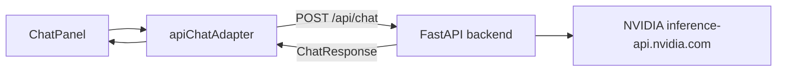

# Nemotron Chat Backend

Aethel's chat panel sends messages through a Python/FastAPI backend
service that holds NVIDIA credentials server-side.  The frontend
`ChatAdapter` contract is unchanged — only the transport flips from a
local mock to a real HTTP call.

## Architecture



The browser never sees the NVIDIA API key.  The backend reads it
from the environment or `~/.netrc` and uses it only to call NVIDIA.

## Prerequisites

- Python 3.11 or later
- `pip install -r api/requirements.txt` (production)
- `pip install -r api/requirements-dev.txt` (development + tests)

## Credential Configuration

The backend reads the NVIDIA API key in this order:

1. **Environment variable** `NVIDIA_API_KEY`
2. **`~/.netrc`** — a `machine inference-api.nvidia.com` entry:

```
machine inference-api.nvidia.com
    login user
    password <your-key>
```

**Never add the key to Vite env vars, `.env` files, or any file that
gets bundled into the frontend.**

If neither source provides a key, `GET /api/health` returns
`"nvidia_key_configured": false` and `POST /api/chat` returns HTTP 503
with a plain-text guide on where to set the key.  The mock adapter
still works without any key.

## Environment Variables

### Backend (server-side only)

| Variable              | Default                                          | Purpose                                     |
|-----------------------|--------------------------------------------------|---------------------------------------------|
| `NVIDIA_API_KEY`      | *(none)*                                         | Override `~/.netrc` for the NVIDIA key      |
| `NVIDIA_API_BASE_URL` | `https://inference-api.nvidia.com/v1`            | NVIDIA API base URL                         |
| `NVIDIA_MODEL`        | `nvidia/nvidia/nemotron-3-nano-omni-30b-a3b-reasoning` | Model ID sent in chat requests        |
| `AETHEL_CHAT_PROVIDER`| `mock`                                           | `mock` or `nvidia` — selects the adapter   |
| `AETHEL_CORS_ORIGINS` | `http://localhost:5173,http://127.0.0.1:5173`    | Comma-separated allowed CORS origins        |

None of these variables should appear in the browser bundle or in any
Vite / frontend config file.

### Frontend (browser-side)

| Variable             | Default  | Purpose                                                       |
|----------------------|----------|---------------------------------------------------------------|
| `VITE_CHAT_PROVIDER` | `mock`   | `mock` or `api` — controls whether the browser posts to `/api/chat` or uses the in-browser mock adapter |

`VITE_CHAT_PROVIDER` holds only the provider name — never an API key or
token.  Set it in `web/.env.local` (not committed) so the Vite dev
server picks it up without requiring a rebuild:

```
# web/.env.local — create this file; do NOT commit it
VITE_CHAT_PROVIDER=api
```

When `VITE_CHAT_PROVIDER` is unset or `mock`, the browser uses the
deterministic in-browser mock adapter and the backend is never contacted.
When set to `api`, every chat message is forwarded to the running backend
at `/api/chat`.

## Makefile Targets

### Run the backend API server

```bash
make run-api
```

Starts `uvicorn api.main:app --reload --port 8000`.  The API is then
available at `http://localhost:8000`.

The frontend Vite dev server (`make run`) continues to run separately
on port 5173.

### Run the backend tests

```bash
make test-api
```

Runs all tests in `api/tests/` using `pytest`.  **No NVIDIA key is
required** — credential-loading tests use fake netrc data injected at
test time.

### Run all quality gates

```bash
make fmt-check   # frontend formatter check
make build       # frontend production build
make test        # frontend unit + component tests
make test-api    # backend unit tests (no NVIDIA key needed)
make lint        # frontend static analysis
```

## API Endpoints

### `GET /api/health`

Liveness check.  Returns HTTP 200 with JSON:

```json
{ "status": "ok", "nvidia_key_configured": true }
```

The `nvidia_key_configured` field is `false` when neither
`NVIDIA_API_KEY` nor a matching `~/.netrc` entry is found.  The key
value is never included in the response.

### `POST /api/chat`

Sends a chat request to the backend.

**Request body** (mirrors `ChatRequest` in `web/src/services/chatAdapter.ts`):

```json
{
  "sessionId": "string (required, non-empty)",
  "userMessage": "string (required, non-empty)",
  "agentState": {
    "id": "string",
    "displayName": "string",
    "personaPreset": "string",
    "tone": "string",
    "behavior": { "curiosity": 0.7, "formality": 0.5, "skepticism": 0.3 },
    "appearance": { "avatarPreset": "robot", "accentColor": "#76b900", "idlePose": "standing" }
  },
  "environmentState": {
    "preset": "office",
    "timeOfDay": "afternoon",
    "lighting": "bright",
    "ambience": "quiet",
    "weather": "clear",
    "objects": [],
    "selectedObject": null
  },
  "recentMessages": [
    { "id": "msg-1", "content": "Hello", "timestamp": 1717600000000, "sender": "user" }
  ]
}
```

**Response body** (mirrors `ChatResponse` in `web/src/services/chatAdapter.ts`):

```json
{
  "response": "string",
  "newMessageId": "string"
}
```

**Error responses:**

| Status | Condition                                                                    |
|--------|------------------------------------------------------------------------------|
| 422    | Request body fails Pydantic validation                                       |
| 503    | `AETHEL_CHAT_PROVIDER=nvidia` but NVIDIA API key is not configured           |
| 429    | NVIDIA API rate limit exceeded (pass-through, retry after back-off)          |
| 502    | NVIDIA API authentication failure or malformed/unexpected response           |
| 504    | NVIDIA API request timed out                                                 |
| 500    | Unhandled server error (internals are not leaked)                            |

## Current Status

The `/api/chat` endpoint routes to the **NVIDIA Nemotron client**
(`api/nvidia_client.py`) when `AETHEL_CHAT_PROVIDER=nvidia`, or returns a
deterministic stub when `AETHEL_CHAT_PROVIDER=mock` (the default).

### Mock-only mode (no credentials required)

The default workflow requires no NVIDIA key and no backend:

```bash
make run          # starts the Vite dev server on port 5173
```

The browser uses the in-browser mock adapter.  Chat replies are
deterministic stubs — useful for UI development and all standard tests.

### Live Nemotron mode (NVIDIA key required)

To enable real model responses, both the backend and the frontend must be
configured:

**Terminal 1 — start the backend:**

```bash
export NVIDIA_API_KEY=sk-...         # or use ~/.netrc (see Credential Configuration)
export AETHEL_CHAT_PROVIDER=nvidia
make run-api                         # starts FastAPI on port 8000
```

**`web/.env.local` — tell the browser to use the backend:**

```
# Create this file (it is git-ignored); do NOT commit it.
VITE_CHAT_PROVIDER=api
```

**Terminal 2 — start the web app:**

```bash
make run          # starts the Vite dev server on port 5173
```

Open `http://localhost:5173` — chat messages now reach
`http://localhost:8000/api/chat` and are answered by the Nemotron model.

The frontend mock adapter continues to work whenever `VITE_CHAT_PROVIDER`
is unset or `mock` — no NVIDIA key is required in that mode.

## Opt-in Live Smoke Check

A live smoke check is provided to verify that the configured credential,
endpoint, model id, prompt mapping, and response parsing work together with a
real network call.  This is separate from the default test suite — it requires
a valid NVIDIA API key and network access to `inference-api.nvidia.com`.

### Run the dry-run (no key needed)

Validate the prompt structure without making a network call:

```bash
make smoke-nemotron-dry-run
```

Sample output:

```
[smoke] DRY-RUN mode — no NVIDIA API call will be made.
[smoke] Credential status : configured
[smoke] Key hint          : sk-X********
[smoke] Endpoint          : https://inference-api.nvidia.com/v1/chat/completions
[smoke] Model             : nvidia/nvidia/nemotron-3-nano-omni-30b-a3b-reasoning
[smoke] Messages (2):
  1. [system] You are Aethel, an AI assistant in a virtual 3D office environment…
  2. [user] Smoke check: reply with the single word 'OK'.
[smoke] Dry-run passed.
```

### Run the live check (NVIDIA key required)

With a valid `NVIDIA_API_KEY` or `~/.netrc` entry configured:

```bash
make smoke-nemotron
```

Exit codes:

| Code | Meaning |
|------|---------|
| 0    | Model returned a text response — endpoint, credential, and parsing all work |
| 1    | Unexpected failure (timeout, malformed response) — check error output |
| 2    | SKIP — credential absent or invalid; treated as non-failure by `make` |

`make smoke-nemotron` treats exit code 2 as a non-failure and prints a
guidance message.  Exit code 1 propagates as a real failure.

### Run the smoke-check unit tests (no key required)

```bash
make smoke-nemotron-test
```

These tests cover all exit paths (skip, fail, success) using mocked NVIDIA
calls.  No NVIDIA key or network access is needed.

### Security guarantees

- The NVIDIA API key is **never** printed, logged, or included in any output.
- Diagnostic messages show only a redacted hint such as `sk-X********`.
- The script never calls NVIDIA from the browser — all credential handling
  is server-side in `api/config.py` and `api/nvidia_client.py`.

### When to run the live check

Run the live smoke check:

- After rotating or replacing the NVIDIA API key.
- After changing `NVIDIA_MODEL` or `NVIDIA_API_BASE_URL`.
- Before deploying the backend to a new environment.

Do **not** wire `make smoke-nemotron` into default CI until credential
management for CI is explicitly designed.

## Testing Credential Loading

The config loading tests in `api/tests/test_config.py` cover:

- Key is resolved from `NVIDIA_API_KEY` environment variable
- Key is resolved from `~/.netrc` machine entry
- Whitespace in the env var is trimmed
- Malformed `~/.netrc` does not crash the server
- Missing key raises `NvidiaKeyNotFoundError` with a helpful message
- Error messages never contain the raw key value
- `redacted_key_hint()` always returns a masked representation

Run them in isolation:

```bash
python3 -m pytest api/tests/test_config.py -v
```

## Troubleshooting

**`make run-api` exits immediately with `ModuleNotFoundError: No module named 'fastapi'`**

Install the backend dependencies first:

```bash
pip install -r api/requirements.txt
```

**`POST /api/chat` returns HTTP 503**

The NVIDIA API key is not configured.  Set `NVIDIA_API_KEY` or add a
`~/.netrc` entry — see [Credential Configuration](#credential-configuration).

**`GET /api/health` returns `nvidia_key_configured: false` but a key is set**

Check that `NVIDIA_API_KEY` has no leading/trailing whitespace and that
the netrc machine name is exactly `inference-api.nvidia.com`.
