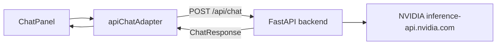

# Nemotron Chat Backend

Aethel's chat panel sends messages through a Python/FastAPI backend
service that holds NVIDIA credentials server-side.  The frontend
`ChatAdapter` contract is unchanged — only the transport flips from a
local mock to a real HTTP call.

## Architecture



The browser never sees the NVIDIA API key.  The backend reads it
from the environment or `~/.netrc` and uses it only to call NVIDIA.

## Prerequisites

- Python 3.11 or later
- `pip install -r api/requirements.txt` (production)
- `pip install -r api/requirements-dev.txt` (development + tests)

## Credential Configuration

The backend reads the NVIDIA API key in this order:

1. **Environment variable** `NVIDIA_API_KEY`
2. **`~/.netrc`** — a `machine inference-api.nvidia.com` entry:

```
machine inference-api.nvidia.com
    login user
    password <your-key>
```

**Never add the key to Vite env vars, `.env` files, or any file that
gets bundled into the frontend.**

If neither source provides a key, `GET /api/health` returns
`"nvidia_key_configured": false` and `POST /api/chat` returns HTTP 503
with a plain-text guide on where to set the key.  The mock adapter
still works without any key.

## Environment Variables

| Variable              | Default                                          | Purpose                                     |
|-----------------------|--------------------------------------------------|---------------------------------------------|
| `NVIDIA_API_KEY`      | *(none)*                                         | Override `~/.netrc` for the NVIDIA key      |
| `NVIDIA_API_BASE_URL` | `https://inference-api.nvidia.com/v1`            | NVIDIA API base URL                         |
| `NVIDIA_MODEL`        | `nvidia/nvidia/nemotron-3-nano-omni-30b-a3b-reasoning` | Model ID sent in chat requests        |
| `AETHEL_CHAT_PROVIDER`| `mock`                                           | `mock` or `nvidia` — selects the adapter   |
| `AETHEL_CORS_ORIGINS` | `http://localhost:5173,http://127.0.0.1:5173`    | Comma-separated allowed CORS origins        |

## Makefile Targets

### Run the backend API server

```bash
make run-api
```

Starts `uvicorn api.main:app --reload --port 8000`.  The API is then
available at `http://localhost:8000`.

The frontend Vite dev server (`make run`) continues to run separately
on port 5173.

### Run the backend tests

```bash
make test-api
```

Runs all tests in `api/tests/` using `pytest`.  **No NVIDIA key is
required** — credential-loading tests use fake netrc data injected at
test time.

### Run all quality gates

```bash
make fmt-check   # frontend formatter check
make build       # frontend production build
make test        # frontend unit + component tests
make test-api    # backend unit tests (no NVIDIA key needed)
make lint        # frontend static analysis
```

## API Endpoints

### `GET /api/health`

Liveness check.  Returns HTTP 200 with JSON:

```json
{ "status": "ok", "nvidia_key_configured": true }
```

The `nvidia_key_configured` field is `false` when neither
`NVIDIA_API_KEY` nor a matching `~/.netrc` entry is found.  The key
value is never included in the response.

### `POST /api/chat`

Sends a chat request to the backend.

**Request body** (mirrors `ChatRequest` in `web/src/services/chatAdapter.ts`):

```json
{
  "sessionId": "string (required, non-empty)",
  "userMessage": "string (required, non-empty)",
  "agentState": {
    "id": "string",
    "displayName": "string",
    "personaPreset": "string",
    "tone": "string",
    "behavior": { "curiosity": 0.7, "formality": 0.5, "skepticism": 0.3 },
    "appearance": { "avatarPreset": "robot", "accentColor": "#76b900", "idlePose": "standing" }
  },
  "environmentState": {
    "preset": "office",
    "timeOfDay": "afternoon",
    "lighting": "bright",
    "ambience": "quiet",
    "weather": "clear",
    "objects": []
  },
  "recentMessages": [
    { "id": "msg-1", "content": "Hello", "timestamp": 1717600000000, "sender": "user" }
  ]
}
```

**Response body** (mirrors `ChatResponse` in `web/src/services/chatAdapter.ts`):

```json
{
  "response": "string",
  "newMessageId": "string"
}
```

**Error responses:**

| Status | Condition                                         |
|--------|---------------------------------------------------|
| 422    | Request body fails Pydantic validation            |
| 503    | NVIDIA API key not configured                     |
| 500    | Unhandled server error (internals are not leaked) |

## Current Status

The `/api/chat` endpoint validates the full request shape but returns a
stub response.  The live NVIDIA model client is added in **TASK-19.3**.
Use `AETHEL_CHAT_PROVIDER=mock` (the default) to keep the in-browser
mock adapter active until the live client is ready.

## Testing Credential Loading

The config loading tests in `api/tests/test_config.py` cover:

- Key is resolved from `NVIDIA_API_KEY` environment variable
- Key is resolved from `~/.netrc` machine entry
- Whitespace in the env var is trimmed
- Malformed `~/.netrc` does not crash the server
- Missing key raises `NvidiaKeyNotFoundError` with a helpful message
- Error messages never contain the raw key value
- `redacted_key_hint()` always returns a masked representation

Run them in isolation:

```bash
python3 -m pytest api/tests/test_config.py -v
```

## Troubleshooting

**`make run-api` exits immediately with `ModuleNotFoundError: No module named 'fastapi'`**

Install the backend dependencies first:

```bash
pip install -r api/requirements.txt
```

**`POST /api/chat` returns HTTP 503**

The NVIDIA API key is not configured.  Set `NVIDIA_API_KEY` or add a
`~/.netrc` entry — see [Credential Configuration](#credential-configuration).

**`GET /api/health` returns `nvidia_key_configured: false` but a key is set**

Check that `NVIDIA_API_KEY` has no leading/trailing whitespace and that
the netrc machine name is exactly `inference-api.nvidia.com`.
