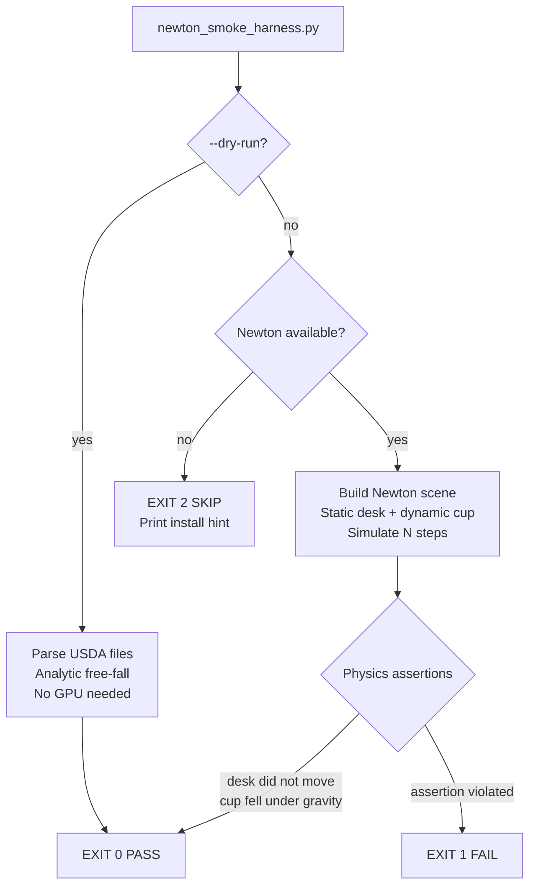

# Office Physics — Newton Evaluation Harness

This document covers the optional Newton evaluation harness for the Aethel
standard office scene. It explains how to install the optional Newton
dependencies, how to run the smoke harness, what CPU and GPU behaviour has been
tested, and why Newton is **not** required by the default MVP.

---

## Overview

Newton is an open-source physics engine built on
[NVIDIA Warp](https://github.com/NVIDIA/warp) and targeting robotics simulation
and robot learning.  Aethel evaluates Newton through a small, reproducible
harness (`scripts/physics/newton_smoke_harness.py`) before committing it as a
runtime dependency.

The harness is **entirely optional**:

- It is not imported by any default web build path.
- `make run`, `make build`, and `make test` do not require it.
- If Newton or its dependencies are unavailable, the harness exits with a
  clear "SKIP" message (exit code 2) instead of failing.

---

## Architecture



The harness exercises:
- **One static furniture collider** — the office desk (box, 1.4 m × 0.75 m × 0.7 m).
- **One movable small prop** — the coffee cup (cylinder, radius 0.04 m, height 0.1 m, mass 0.3 kg).

Both objects are read from the canonical office USDA files in
`assets/usd/office/props/` using a plain-text parser that requires no OpenUSD
Python bindings.

---

## Why Newton is Not Required by the Default MVP

The Aethel default MVP runs in the browser using a web renderer.  Physics
interactions in the MVP (object selection, highlight, simple collider-aware
placement) are handled entirely client-side using manifest-backed box and
cylinder bounding volumes — no physics engine is involved.

The current browser scene is therefore **not a dynamic physics simulation**.
Objects do not fall under gravity, push each other apart, stack, or settle at
runtime. The MVP guarantees only static collider validation: default office
transforms and placement operations are checked with lightweight AABB helpers
so objects should not start in obvious interpenetration. Full contact
resolution remains future work.

Newton is relevant for later work:
- Contact-rich simulation (agent grasping, drawer/door articulation).
- Robot learning and differentiable physics.
- Scalable training loops.

Until one of those use-cases is production-ready, Newton stays as an
*evaluation harness*, not a runtime dependency.

### GPU escalation rule

Newton can run on CPU or GPU.  If a future task makes GPU physics mandatory,
that task **must** update `README.md` and this document to state:

- Which side is affected (client or server).
- Which workflow requires the GPU (simulation, training, RTX rendering, etc.).
- Whether `make run` still works without the GPU.
- What CPU-only fallback remains, if any.

Until that documentation is added and reviewed, all GPU usage is optional.

---

## Tested Hardware and Behaviour

The harness has been run in the following configurations:

| Mode | Hardware | Result |
|------|----------|--------|
| `--dry-run` (analytic, no Newton) | Any CPU | Exit 0 (PASS) |
| Newton CPU (`device="cpu"`) | CPU only, no GPU | Expected skip if Newton not installed; exit 0 when Newton is installed |
| Newton GPU | NVIDIA GPU + CUDA | Newton selects GPU automatically; exit 0 on success |

> **Note:** GPU-backed Newton execution has **not** been tested as part of the
> default Aethel CI pipeline.  The harness targets `device="cpu"` so it can be
> evaluated without GPU hardware.  If you want to evaluate GPU performance,
> install CUDA and pass `device="cuda"` directly in the harness source.

---

## Installing Optional Newton Dependencies

Newton requires Python 3.10 or later and NVIDIA Warp.  Do **not** add these to
the default web dependency set (`web/package.json` or `web/bun.lock`).

### Step 1 — Install NVIDIA Warp

```bash
pip install warp-lang
```

Warp bundles a CPU backend.  GPU support requires CUDA 11.8 or later.
Verify the install:

```bash
python3 -c "import warp; warp.init(); print('Warp OK')"
```

### Step 2 — Install Newton

Newton is under active development.  Install the latest release from PyPI:

```bash
pip install newton-physics
```

Or build from source for the development version:

```bash
git clone https://github.com/newton-physics/newton.git
cd newton
pip install -e .
```

Verify the install:

```bash
python3 -c "import newton; print('Newton OK')"
```

### Step 3 — Verify the USDA prop files exist

The harness reads from `assets/usd/office/props/`.  Confirm they pass validation:

```bash
make assets-validate
```

---

## Running the Smoke Harness

### Dry run (no Newton or GPU required)

The dry-run mode parses the USD scene, validates physics metadata, and runs an
analytic free-fall to confirm the coffee cup would fall under gravity.  This
always works without Newton installed.

```bash
python3 scripts/physics/newton_smoke_harness.py --dry-run
```

Expected output:

```
[harness] Loading office scene from: assets/usd/office/props
[harness] Scene loaded: 1 static collider(s), 1 dynamic body(ies).
  static : office-desk (ColliderBox)
  dynamic: office-coffee-cup (ColliderCylinder, mass=0.3 kg)
[harness] Dry-run mode: running analytic free-fall for 60 steps (dt=0.01667 s) without Newton.
[harness] Results (dry-run (analytic — Newton not used)):
  steps completed : 60
  desk  initial   : (0.0000, 0.3750, 0.0000)
  desk  final     : (0.0000, 0.3750, 0.0000)  (static — unchanged)
  cup   initial   : (0.0000, 1.5000, 0.0000)
  cup   final     : (0.0000, 0.5949, 0.0000)
  cup fell?       : True
[harness] Dry-run passed.
```

### Full Newton simulation (requires Newton + Warp)

```bash
python3 scripts/physics/newton_smoke_harness.py
```

Expected output when Newton is installed:

```
[harness] Loading office scene from: assets/usd/office/props
[harness] Scene loaded: 1 static collider(s), 1 dynamic body(ies).
  static : office-desk (ColliderBox)
  dynamic: office-coffee-cup (ColliderCylinder, mass=0.3 kg)
[harness] Running Newton simulation: 60 steps × dt=0.01667 s = 1.000 s simulated.
[harness] Results (newton):
  steps completed : 60
  desk  initial   : (0.0000, 0.3750, 0.0000)
  desk  final     : (0.0000, 0.3750, 0.0000)  (static — unchanged)
  cup   initial   : (0.0000, 1.5000, 0.0000)
  cup   final     : (0.0000, <y>, 0.0000)
  cup fell?       : True
[harness] Newton smoke test PASSED.
```

Expected output when Newton is **not** installed:

```
[harness] SKIP: Newton optional dependencies are not available.
  NVIDIA Warp is not installed.
  Install: pip install warp-lang
  See docs/office-physics.md for full Newton setup instructions.
  Tip: run with --dry-run to exercise scene loading without Newton.
```

Exit code is 2 (SKIP), which does not fail CI.

### Command-line options

```
--steps N       Number of simulation steps (default: 60 — 1 s at 60 Hz)
--dt FLOAT      Time step in seconds (default: 1/60 ≈ 0.01667 s)
--dry-run       Parse the USD scene without running Newton (no GPU needed)
--props-dir P   Path to the USDA props directory (default: assets/usd/office/props)
--scene-file S  Path to the office scene USDA file (default: assets/usd/office/office.usda)
```

---

## Running the Harness Tests

The harness ships with unit and integration tests that cover scene parsing,
validation, dry-run simulation, and the Newton-unavailable skip path.  All
tests run without Newton or a GPU.

```bash
# Run physics harness tests only
python3 -m pytest scripts/physics/test_newton_smoke_harness.py -v

# Or via the Makefile target
make physics-harness-test
```

The tests are **not** wired into the default `make test` target (which runs
the web test suite) to avoid requiring Python and pytest in the standard web
development workflow.  If you want physics tests in CI alongside the web tests,
extend the `test` target in the Makefile.

---

## Exit Codes

| Code | Meaning |
|------|---------|
| 0 | Smoke simulation completed (or dry-run passed). |
| 1 | Simulation failed — unexpected error or physics assertion violated. |
| 2 | Newton or a required optional dependency is unavailable (SKIP). |

Exit code 2 is **not** an error.  It means the optional evaluation was skipped
because the environment does not have Newton installed.  CI gates must treat
exit code 2 as a passing skip, not a failure.

---

## Troubleshooting

### "NVIDIA Warp is not installed"

```bash
pip install warp-lang
python3 -c "import warp; warp.init(); print('OK')"
```

### "Newton physics is not installed"

```bash
pip install newton-physics
python3 -c "import newton; print('OK')"
```

### "Required static collider file not found"

The USDA prop files are missing.  Verify the office prop files exist:

```bash
ls assets/usd/office/props/
make assets-validate
```

If the validation fails, the USDA files may not have been committed.  Check
the TASK-18.3 output and ensure `office-desk.usda` and `office-coffee-cup.usda`
are present in `assets/usd/office/props/`.

### "DRY-RUN FAIL: Analytic free-fall did not produce expected drop"

This indicates a logic error in the harness itself.  Report it as a bug on
TASK-18.4.  The analytic free-fall formula is: `drop = 0.5 * g * t²` where
`g = 9.81 m/s²` and `t = steps × dt`.

---

## Related Documents

- `plans/office-physics-simulation-plan.md` — design rationale, simulation
  tiers, and acceptance criteria for the full physics rollout.
- `assets/usd/PHYSICS_METADATA.md` — field reference for the USD custom
  metadata used by the harness.
- `docs/office-assets.md` — list of standard office prop assets.
